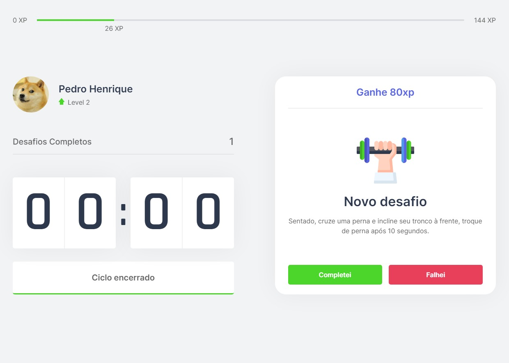

# Sobre o Projeto

Moveit consiste em uma aplicação front-end desenvolvida na quarta edição da semana Next Level, realizada pela Rocket Seat.
O sistema se inspira na famosa [Técnica Pomodoro](https://pt.wikipedia.org/wiki/T%C3%A9cnica_pomodoro) para promover a realização de exercicios
para o corpo e os olhos.

# Tecnologias Utilizadas
## Front-end
* Next.js
* Context API
* TypeScript

# Layout

 

 
